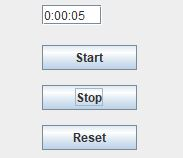

# Concurrency
#### by Jørgen Staunstrup, jst@itu.dk, draft version Oct 20, 2020

The note starts by taking a helicopter view on concurrency where we ignore performance details.
Instead the focus is more qualitative identifying a few core concepts that directly reflect
the different motivations for using concurrency.

*Concurrency programming* is a set of concepts and abstractions used for writing software with multiple 
independent streams of statements/instructions [^1]. This may be contrasted with sequential programming which deals with
only a single stream of statements. In this note, we use the term *stream* [^2] to denote software component 
with a single stream of statements e.g.

```
stream t = new stream(() -> {
  s1;s2;s3; ...
});
```
The body of a stream may contain all the well-known programming concepts e.g. loops, if-statements, variable declarations and functions. 
Anything, one would write in the `main method` of a Java program.


The syntax in this note is close to Javas syntax, but some of the code below, is not 100 % valid Java.

[^1]: stream implies that there is an ordering of the statements. 
[^2]: you may think of a stream as a thread with no overhead. Not to be confused with the Java data type ``Stream``.
 
 ---

Writings about concurrency has introduced a number of programming abstractions for concurrency programming. However, there is not (yet)
a widely accepted uniform terminology or set of abstractions e.g. to discuss how to coordinate threads.
This is in 
contrast to functions/methods and parameters which are roughly the same in most programming languages.

Most often concurrency concepts are discussed with a strong emphasis on performance. This is natural because concurrency is often used
to improve performance. However, the performance bias often introduce extra complexity. 
For example, the interplay of the memory model and locking mechanisms in
Java is quite complex. In this note, we focus on introducing a few abstract concurrency concepts ignoring the complexity of their efficient
implementation.

The first such term is *stream* that we use as an abstraction for discussing the following three 
fundamental motivations for concurrency:

* User interfaces and other kinds of input/output (Nygaard Intrinsic).
* Hardware capable of simultaneously executing multiple streams of statements (Nygaard Exploitation),<br>
  a special (but important) case is communication and coordination of independent computers on the internet,
* Enabling several programs to share some resources in a manner where each can act as if they had sole ownership (Nygaard Concealed).

Concurrency programming has a number of additional challenges compared to sequential programming; first and foremost
handling *coordination* when the independent streams need to collaborate, compete for resources 
or exchange information. The term *coordination* is used here as an abstraction of more low level terms like synchronization, locking, communication, ...
that one typically finds in writings about concurrency.

Concurrency and *nondeterminism* are two related but different concepts. Concurrent programs may certainly behave nondeterministicly, for example,
when different streams share variables and the result of the computation differs because of the detailed timing of the statements in the streams.
However, a nondeterministic computation may be completely sequential if a statement for throwing a dice (coin, random number, ...) is introduced.

The greatest challenge in concurrency programming is getting the streams to coordinate reliably in the face of 
this nondeterminism. Therefore, it is important not to prematurely focus on performance. This will only complicate getting the coordination
correct.


## A brief history of concurrency

The very first computers for general purpose were only meant for running one program at a time. However, they gradually became powerful enough
that a small number of users could share the computer. The computer itself could still only execute a single 
sequence of commands/instructions. However,
users had the illusion that they had the computer for themselves. This was called *timesharing* (and was indeed analogous to the concept of
timesharing an apartment). Today, we have the somewhat opposite situation where the hardware in a laptop or smart-phone is capable of running
several streams simultaneously, because it has a small number of processors called *cores*.

In the meantime, the focus of concurrency programming has shifted several times and this has led to the terminology being somewhat confusing.
For example, the first programming languages used the term *process* to denote a single independent stream of statements/instructions. 

## Going into more details with the three types of concurrency.

The three fundamental types of concurrency described above are not always viewed as instances of a more general concept. 
The thesis of this note is that there are some common abstractions covering all three. Performance details are set aside (because
they often introduce a lot of low-level considerations). Performance may of course turn out to be important, but this is certainly not
always the key challenge. Finding the right abstract program structure is often the key to writing good software.
Historically, the importance of the fundamental motivations for concurrency has changed over time, and hence a number of programming language 
constructs introduced over the years
have only addressed one or two of them well. 


### Hardware capable of simultaneously executing multiple streams of statements (Nygaard Exploitation)

Today, most laptops smart phones and servers have hardware capable of executing several streams of instructions. 
These are called multi-core computers and each core is an independent processor. To take advantage of
multiple cores the software must be written in such a way that independent streams of statements can be separated
and directed to the different cores/processors. In Java, this can be done by making each independent
stream of statements a thread. 

#### Example
Below is an example of code where concurrency multiple streams are used to speed up a computation
(running on a computer with multiple cores). Three streams collaborate on counting the number of primes less than 3 million.

```
stream t1= new stream(() -> {
  for (int i=0; i<999999; i++)
    if (isPrime(i)) counter.increment();
});

stream t2= new stream(() -> {
  for (int i=1000000; i<1999999; i++)
    if (isPrime(i)) counter.increment();
});

stream t3= new stream(() -> {
  for (int i=2000000; i<2999999; i++)
    if (isPrime(i)) counter.increment();
});

```

### Interacting with the environment (Nygaard Intrinsic)

Almost any computer needs to communicate with its environment, e.g. to get input or to show results. 
In sequential programs this may be done with statements like `read` or `write`:

```
  n= read();
  res= computeNoOfPrimess(n);
  write(res);
```

However, this will force the computer executing the code to stop and wait for the user to provide input
(and for the output to complete). This is not convenient, if there are many independent communication channels e.g. 
multiple buttons and text fields on a webpage, or on a smart-phone. Similarly, for a computer embedded in a robot that
needs to listen for input from many different sensors to navigate safely.

So whenever a there is an independent stream of external events that needs the computers attention, there
should be an independent stream in its program handling the stream of events.


```
  //Code for a user interface
  stream searchField= new stream(() -> {
    newText= await(searchField);
		search(newText);
	});

  stream stopApp= new stream(() -> {
		await(stopButton);
		exitApp;
	});
```

## Resource sharing (Nygaard Concealed)

Many apps may be active on a smartphone, but most of the time they are idle waiting for something to happen e.g. an e-mail arriving,
download finishing, alarm clock activated etc. Therefore, the underlying operating system will typically have many streams executing
on the same processor (core). Since each of the streams is idle (waiting) most of the time, none of them will "notice" that other streams
are running on the same processor.

```
//e-mail app

stream Email= new stream(() -> {
  do {
    await(email);
    notify(user);
    store(email_in_inbox);
  } forever
})

// Stopwatch app
stream stopWatch= new stream(() -> {
  do {
    alarmAt= await(start button);
    waitUntil(alarmAt);
    notify user;
  } forever
})
```

### Resume

This section has introduced the stream concept for concurrency programming and examplified its use for handling three fundamental
motivations for using concurrency. In the next section, we will discuss coordination of streams illustrated with code for a simple Stopwatch.

## Stream coordination

If streams were completely independent, they would be of limited use. As with people, most of the time they go about their daily
business independently of other people. However, every now and then they need to coordinate their activities, e.g. share some
information, enter private areas (like a toilet), compete for limited resources etc. Streams have similar needs. This has led to
the introduction of a number of programming concepts allowing streams to interact. As with the terminology for concuurency in general, 
the terminology used for coordination is often confusing and inconsistent. 

There are two main types of coordination needs for streams in software: sharing information and exchanging information. The concepts
can be also found in human coordination. An example of sharing information would be a bulletin board. Sending and receiving messages/letters
is an example exchanging information. 

For computers, there is also a very physical manifestation of the two types of coordination. In some cases, computers may
physically share some or all of their memory. In other cases, they may be connected with a network, where information can only
be exchanged via some form of communication link.

There have been numerous attempts to introduce programming languages strictly focusing on one of the two types of coordination. For example,
Concurrent Pascal was an early object-oriented language where all coordination had to be done through shared objects. Other languages/concepts
for concurrency were based on message passing, as the only way for streams to coordinate. An example would be the Http protocol.

Theoretically, sharing objects and message passing are equally powerful. One can always simulate one of them with the other. Therefore,
the more general term *coordination* is used here.


## The Stopwatch example

The two types of coordination can be illustrated by a simple stopwatch.



The stopwatch has three buttons (Start, Stop and Reset) and a textfield for showing the running time. Following the principles 
outlined above, the Stopwatch
can be programmed with three streams (one for each of the buttons), and a stream for writing the textfield.  Finally,
we need a stream that emits a "tick" every second. All five streams are examples of intrinsic concurrency. A function `notify` is used for coordination. In the 
next section, we will explain how this can be implemented using either shared objects or message passing. 

```
stream startButton= new stream(() -> {
  await(startButton);
  notify(textField);
});

stream stopButton= new stream(() -> {
  await(startButton);
  notify(textField);
});

stream resetButton= new stream(() -> {
  await(startButton);
  notify(textField);
});

stream textField= new stream(() -> {
  private int t= 0; private boolean running= false;
  await{
    start: running= true;
    stop: running= false;
    reset: write(0); t= 0;
    tick: if (running) write(t++); 
  }
});

stream clock = new stream(() -> {
  while true {
    await{1 second};
    notify(textField);
  }
});
```

## Coordination using shared objects

To coordinate the streams using shared objects, we could use an object holding the state i.e. counter (int t) and a boolean (boolean running).

```
object SecCounter {
  private int t;  private boolean running;

  setRunning(boolean running) { this.running= running;  }

  boolean running(){ return this.running;  }

  int incr(){
    if running seconds++; 
    return running;
  }

  reset(){
    t= 0;  running= false;
  }
}
```
Using this shared object, the five streams become:

```
stream startButton= new stream(() -> {
  await(startButton);
  SecCounter.setRunning(true);
});

stream stopButton= new stream(() -> {
  await(startButton);
  SecCounter.setRunning(false); 
});

stream resetButton= new stream(() -> {
  await(startButton);
  SecCounter.reset();
});

stream textField= new stream(() -> {
  await
    tick: write(SecCounter.incr()); 
  }
});

stream clock = new stream(() -> {
    await{1 second};
    notify(textField);
});
```

You may find a complete Java version of the Stopwatch here:  [Link to StopWatch.java](Code/Stopwatch.java)

## Coordination using message passing

When using message passing, it is not possible to share objects (memory). The state of the Stopwatch (`t` and `running`)
is kept locally in the textField stream.

```
stream startButton= new stream(() -> {
  await(startButton);
  sendMessage(textField, start);
});

stream stopButton= new stream(() -> {
  await(startButton);
  sendMessage(textField, stop);
});

stream resetButton= new stream(() -> {
  await(startButton);
  sendMessage(textField, reset);
});

stream textField= new stream(() -> {
  int t= 0; running= false;
  await{
    start: running= true;
    stop: running= false;
    reset: write(0); t= 0; running= false;
    tick: if (running) write(t++); 
  }
});

stream clock = new stream(() -> {
  while true {
    await{1 second};
    sendMessage(textField, tick);
  }
});
```

The branching await:

```
await{
    start: running= true;
    stop: running= false;
    reset: write(0); t= 0;
    tick: if (running) write(t++); 
  }
```

is not available in all message passing libraries. In the Http protocol port numbers are used to partly achieve the same.
In message passing libraries where it is not available you must do something like this:

```
waitmessage(sender, content);
if   sender == start    {  .... }
else if sender == stop  {  .... }
else if sender == reset {  .... }
else if sender == tick  {  .... }

```

Note that this selection between different senders is very elegantly handled with shared objects, where the senders simply calls
different methods in the shared object.

### Coordination using reactive concepts

A number of modern programming languages has incorporated concepts for *reactive* programming allowing the
Stopwatch to be coded like this:
```
  timer.filter(value -> myUI.running()).subscribe(display);
```

This section is not yet completed, see the [Readme file for week9](readme.md) for links about RxJava.


