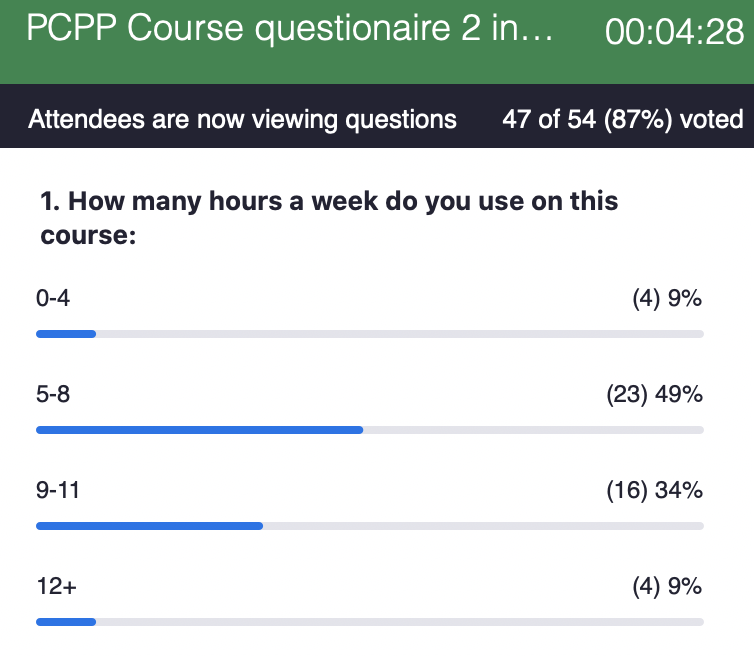
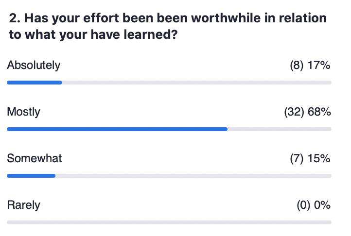
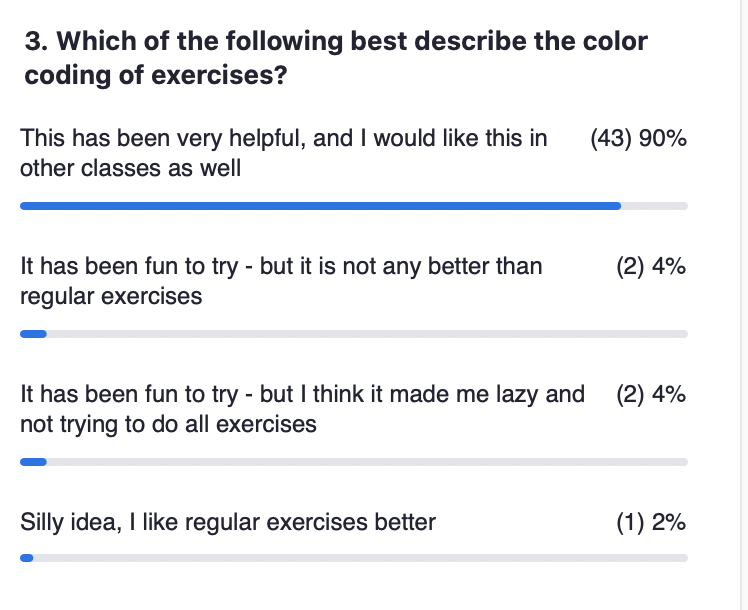
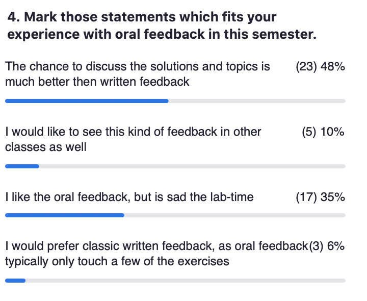
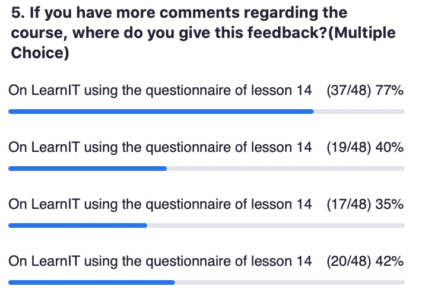
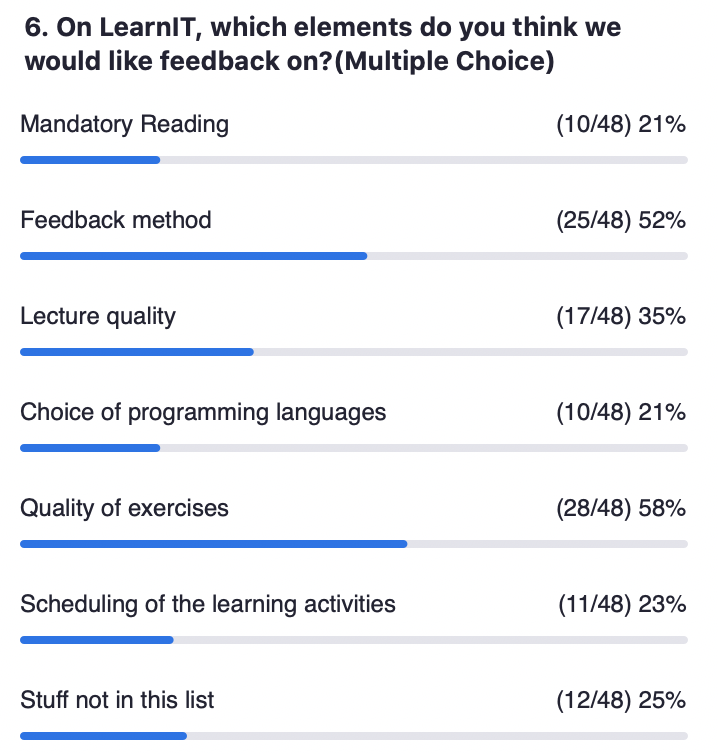

# Info about examination Week 14
## Friday Nov 27th to Thursday Dec 3rd

The lecture on Friday Nov 27 is devoted to info about the examination.

There will be no exercises (and therefore no feedback session on Dec 3). Instead, 
please do the course evaluation (opened on Friday Nov 27).

### Old exam questions
The exam questions from earlier years are in the "old_exams" folder. Several of the earlier exams came with a code supplement. Exam and code are named after the semester of the class.

Notice that the mandatory readings have varried a bit over the years, in particular RxJava and kotlin was not part of the class earlier, whereas transactional memory and akka was. Channels and sequential processes were also done in other languages.

### Readings
There is no new material to read, but you are encouraged to study the 
[mandatory reading for the course](mandatoryReadingPCPP.pdf).

Questions to the mandatory reading will be adressed at the last lecture on Friday Dec 4.

You may also ask questions to all parts of the course material (readings, lectures and exercises). 

Please ask these in the:
[Questions and Answers for PCPP](https://learnit.itu.dk/mod/forum/view.php?id=123231) on LearnIT.

You may also ask Kasper and Jørgen to repeat something form the course. We will then do this
at the last lecture on Friday Dec 4.

### Course evaluation
Please make sure that you complete [the course evaluation](https://learnit.itu.dk/mod/feedback/view.php?id=128280) (deadline Thursday Dec 3rd). 
A summary of the results will be presented at the last lecture on Friday Dec 4.

We held an in-class poll, which had the following results:

It was clear that question 3&4 should have been a multiple choice.

### Slides
[Slides](lecture14_slides.pdf)

### Lecture recordings
[Lecture 14 recording](https://use.vg/MiuRLzRurxSK)
